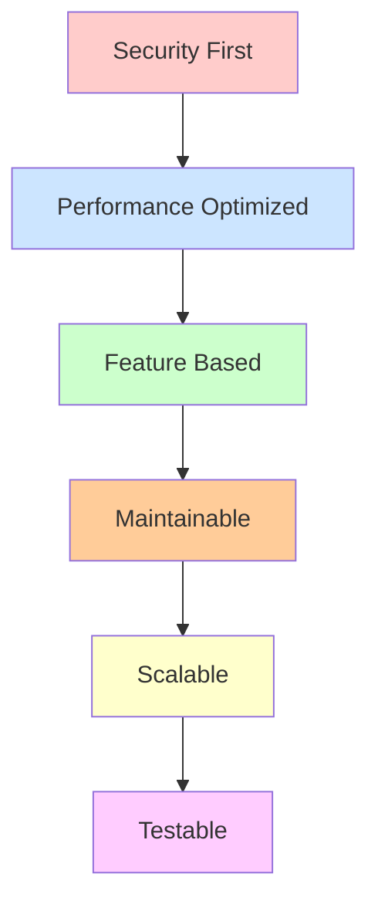
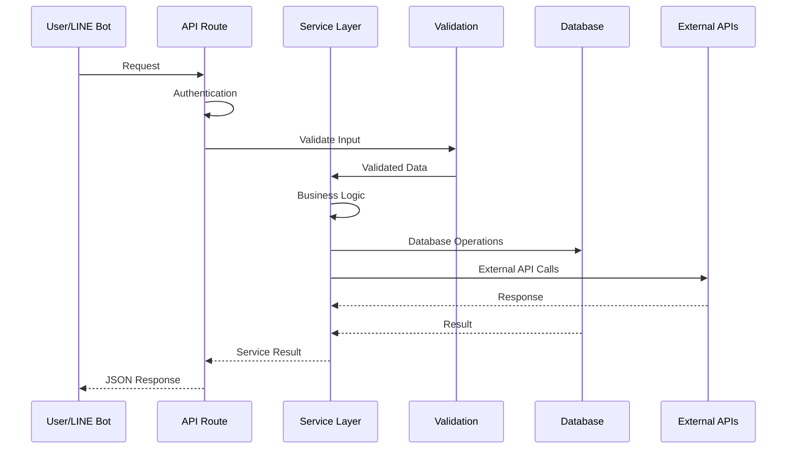
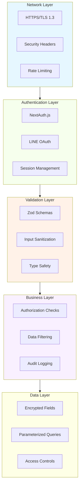
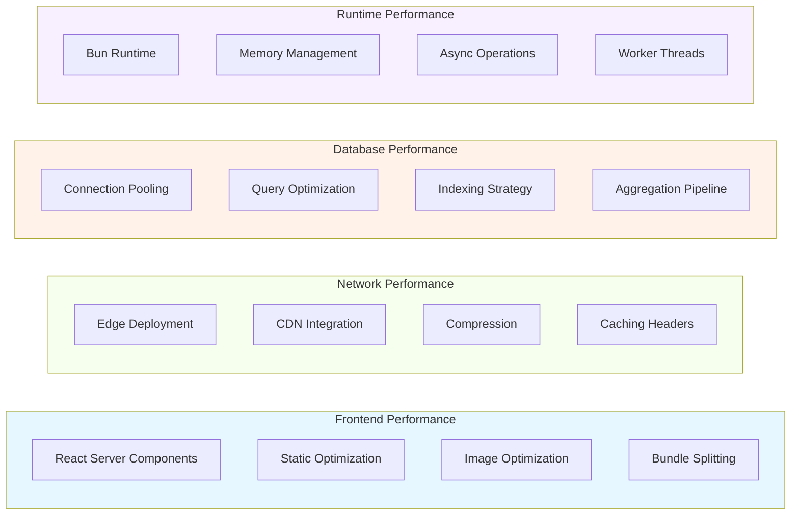
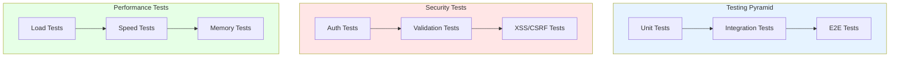
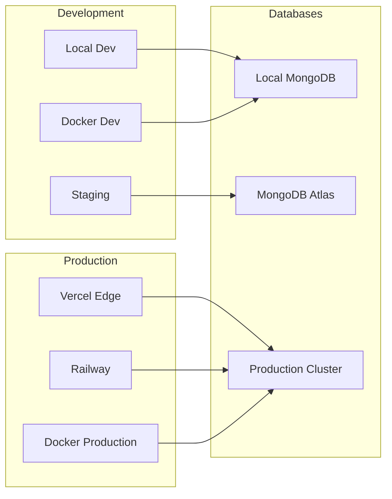

```mermaid
graph LR
    subgraph frontend [Frontend Layer]
        A[React 19 + Next.js 15]
        B[TypeScript]
        C[Tailwind CSS]
    end
    
    subgraph api [API Layer]
        D[Next.js API Routes]
        E[Server Actions]
        F[LINE Webhook]
    end
    
    subgraph business [Business Layer]
        G[Feature Services]
        H[Authentication]
        I[Validation]
    end
    
    subgraph data [Data Layer]
        J[Prisma ORM]
        K[MongoDB]
        L[External APIs]
    end
    
    frontend --> api
    api --> business
    business --> data
    
    style frontend fill:#e6f7ff
    style api fill:#f6ffed
    style business fill:#fff2e8
    style data fill:#f9f0ff
```

# 🏗️ สถาปัตยกรรมระบบ | System Architecture

> **🎯 สถาปัตยกรรมและการออกแบบระบบ Bun LINE T3 Attendance**
> 
> **⚡ Modern Architecture**: Feature-Based + Security-First + Performance-Optimized

## 📋 สารบัญ | Table of Contents

- [🌟 ภาพรวมสถาปัตยกรรม](#-ภาพรวมสถาปัตยกรรม)
- [🏗️ โครงสร้างโปรเจกต์](#️-โครงสร้างโปรเจกต์)
- [🎯 Feature-Based Architecture](#-feature-based-architecture)
- [🔄 Data Flow และ State Management](#-data-flow-และ-state-management)
- [🔐 Security Architecture](#-security-architecture)
- [⚡ Performance Architecture](#-performance-architecture)
- [🌐 API Design](#-api-design)
- [🗄️ Database Design](#️-database-design)
- [🧪 Testing Architecture](#-testing-architecture)
- [🚀 Deployment Architecture](#-deployment-architecture)

## 🌟 ภาพรวมสถาปัตยกรรม | Architecture Overview

### 🏛️ Core Principles | หลักการสำคัญ



### 🎨 Technology Stack Overview



## 🏗️ โครงสร้างโปรเจกต์ | Project Structure

### 📁 High-Level Structure

```
📂 bun-line-t3/
├── 🔧 Configuration Files      # การกำหนดค่าระบบ
│   ├── bun.config.test.ts     # Bun test configuration
│   ├── next.config.mjs        # Next.js configuration
│   ├── tailwind.config.ts     # Tailwind CSS config
│   ├── tsconfig.json          # TypeScript config
│   └── eslint.config.mjs      # ESLint rules
│
├── 🔐 Security & Certificates # ความปลอดภัยและใบรับรอง
│   └── certificates/
│       ├── localhost.pem      # SSL certificate
│       └── localhost-key.pem  # SSL private key
│
├── 🗄️ Database & Schema       # ฐานข้อมูลและ Schema
│   └── prisma/
│       └── schema.prisma      # MongoDB schema with Prisma
│
├── 📚 Documentation          # เอกสารประกอบ
│   └── docs/
│       ├── README.md         # Documentation overview
│       ├── SETUP.md          # Setup instructions
│       └── [20+ other docs]  # Comprehensive documentation
│
├── 🧪 Testing Infrastructure # ชุดทดสอบ
│   └── tests/
│       ├── components/       # Component tests
│       ├── features/         # Feature tests
│       ├── integration/      # Integration tests
│       └── api/             # API tests
│
├── ⚙️ Scripts & Automation   # สคริปต์และระบบอัตโนมัติ
│   └── scripts/
│       ├── generate-secrets.ts    # Security key generation
│       ├── checkout-reminder.ts   # Automated reminders
│       └── health-check.sh        # Health monitoring
│
└── 🎯 Core Application      # แอปพลิเคชันหลัก
    └── src/
        ├── 📱 app/          # Next.js 15 App Router
        ├── 🧩 features/     # Feature-based modules
        ├── 🔧 lib/          # Shared utilities
        ├── 🎨 components/   # UI components
        └── 🎣 hooks/        # Custom React hooks
```

### 🎯 Feature-Based Organization

```
📂 src/features/
├── 🏢 attendance/          # Attendance Management
│   ├── api/               # API routes
│   ├── services/          # Business logic
│   ├── types/             # TypeScript definitions
│   ├── utils/             # Helper functions
│   └── index.ts           # Barrel exports
│
├── 🔐 auth/               # Authentication
│   ├── services/          # Auth services
│   ├── types/             # Auth types
│   └── utils/             # Auth utilities
│
├── 💬 line/               # LINE Bot Integration
│   ├── services/          # LINE API services
│   ├── types/             # LINE-specific types
│   └── handlers/          # Message handlers
│
├── 💰 crypto/             # Cryptocurrency Tracking
│   ├── services/          # Market data services
│   ├── types/             # Crypto types
│   └── utils/             # Price calculations
│
└── 🌍 air-quality/        # Air Quality Monitoring
    ├── services/          # AQI data services
    ├── types/             # AQI types
    └── utils/             # AQI calculations
```

## 🎯 Feature-Based Architecture

### 🧩 Feature Module Pattern

```typescript
// ✅ Example: Attendance Feature Structure
// src/features/attendance/

// Types และ Interfaces
export interface AttendanceRecord {
  readonly id: string
  readonly userId: string
  readonly checkInTime: Date
  readonly checkOutTime?: Date
  readonly workHours?: number
  readonly status: 'checked-in' | 'checked-out' | 'auto-checkout'
}

// Service Layer - Business Logic
export const attendanceService = {
  async checkIn(userId: string): Promise<AttendanceRecord> {
    // Validation
    const existingRecord = await findTodayRecord(userId)
    if (existingRecord) throw new Error('Already checked in today')
    
    // Business Logic
    const checkInTime = new Date()
    const expectedCheckOut = addHours(checkInTime, 9)
    
    // Database Operation
    return await db.attendance.create({
      data: { userId, checkInTime, expectedCheckOut }
    })
  },
  
  async checkOut(userId: string): Promise<AttendanceRecord> {
    // Implementation...
  }
}

// API Layer - Route Handlers
export async function POST(request: Request) {
  // 1. Authentication
  const session = await getServerSession()
  if (!session) return unauthorized()
  
  // 2. Validation
  const body = await request.json()
  const data = AttendanceSchema.parse(body)
  
  // 3. Business Logic
  const result = await attendanceService.checkIn(session.user.id)
  
  // 4. Response
  return Response.json(result)
}
```

### 🔄 Cross-Feature Communication

```typescript
// ✅ Barrel Exports สำหรับ Clean Imports
// src/features/attendance/index.ts
export * from './services/attendance'
export * from './types'
export * from './utils'

// ✅ Clean Import Pattern
import { attendanceService, type AttendanceRecord } from '@/features/attendance'
import { lineService } from '@/features/line'
import { authService } from '@/features/auth'

// ✅ Cross-Feature Integration
const handleCheckIn = async (userId: string) => {
  // Use attendance service
  const record = await attendanceService.checkIn(userId)
  
  // Notify via LINE
  await lineService.sendMessage(userId, `✅ เข้างานสำเร็จ ${format(record.checkInTime, 'HH:mm')}`)
  
  return record
}
```

## 🔄 Data Flow และ State Management

### 🌊 Request Flow Architecture



### ⚡ React State Management

```typescript
// ✅ Server Components (Default)
const AttendanceReport = async ({ userId }: { userId: string }) => {
  // Server-side data fetching
  const data = await attendanceService.getMonthlyReport(userId)
  
  return <ReportDisplay data={data} />
}

// ✅ Client Components (เฉพาะเมื่อจำเป็น)
'use client'

import { useActionState } from 'react'

const CheckInForm = () => {
  const [state, formAction, isPending] = useActionState(checkInAction, {
    message: '', success: false
  })
  
  return (
    <form action={formAction}>
      <button type="submit" disabled={isPending}>
        {isPending ? 'กำลังบันทึก...' : 'เข้างาน'}
      </button>
      {state.message && <div>{state.message}</div>}
    </form>
  )
}
```

## 🔐 Security Architecture

### 🛡️ Multi-Layer Security



### 🔒 Security Implementation

```typescript
// ✅ Input Validation με Zod
const AttendanceSchema = z.object({
  userId: z.string().uuid(),
  timestamp: z.date(),
  location: z.string().max(100).optional(),
  notes: z.string().max(500).optional(),
}).strict() // ปฏิเสธ unknown properties

// ✅ Secure API Handler Pattern
export async function POST(request: Request) {
  try {
    // 1. 🔐 Authentication
    const session = await getServerSession(authOptions)
    if (!session) {
      return NextResponse.json({ error: 'Unauthorized' }, { status: 401 })
    }
    
    // 2. ✅ Input Validation
    const body = await request.json()
    const validatedData = AttendanceSchema.parse(body)
    
    // 3. 🛡️ Authorization
    if (!hasPermission(session.user, 'CREATE_ATTENDANCE')) {
      return NextResponse.json({ error: 'Forbidden' }, { status: 403 })
    }
    
    // 4. 🧠 Business Logic
    const result = await attendanceService.create(validatedData)
    
    // 5. 📝 Audit Logging
    await auditLogger.log('ATTENDANCE_CREATED', {
      userId: session.user.id,
      recordId: result.id
    })
    
    return NextResponse.json(result)
    
  } catch (error) {
    // 🚨 Secure Error Handling
    if (error instanceof z.ZodError) {
      return NextResponse.json(
        { error: 'Invalid input', details: error.errors },
        { status: 400 }
      )
    }
    
    // Don't leak internal errors
    return NextResponse.json(
      { error: 'Internal server error' },
      { status: 500 }
    )
  }
}
```

## ⚡ Performance Architecture

### 🚀 Performance Optimizations



### ⚡ Performance Implementation

```typescript
// ✅ React Server Components สำหรับ Performance
const MonthlyReport = async ({ userId, month }: ReportProps) => {
  // Server-side data fetching - ไม่มี client-side JavaScript
  const [attendanceData, statisticsData] = await Promise.all([
    attendanceService.getMonthlyData(userId, month),
    attendanceService.getStatistics(userId, month)
  ])
  
  return (
    <div className="space-y-6">
      <AttendanceChart data={attendanceData} />
      <StatisticsCards data={statisticsData} />
    </div>
  )
}

// ✅ Database Query Optimization
export const attendanceService = {
  async getMonthlyData(userId: string, month: Date) {
    return await db.attendance.findMany({
      where: {
        userId,
        checkInTime: {
          gte: startOfMonth(month),
          lte: endOfMonth(month)
        }
      },
      select: {
        // Only select required fields
        id: true,
        checkInTime: true,
        checkOutTime: true,
        workHours: true
      },
      orderBy: { checkInTime: 'asc' }
    })
  }
}

// ✅ Caching Strategy
const cache = new Map<string, { data: any; expires: number }>()

export const withCache = <T>(
  key: string,
  fn: () => Promise<T>,
  ttl: number = 300000 // 5 minutes
): Promise<T> => {
  const cached = cache.get(key)
  if (cached && cached.expires > Date.now()) {
    return Promise.resolve(cached.data)
  }
  
  return fn().then(data => {
    cache.set(key, { data, expires: Date.now() + ttl })
    return data
  })
}
```

## 🌐 API Design

### 🔌 RESTful API Structure

```
📋 API Endpoints Structure
├── GET    /api/health                    # System health check
├── POST   /api/line                      # LINE webhook
├── GET    /api/auth/[...nextauth]        # NextAuth routes
│
├── 🏢 Attendance APIs
│   ├── POST   /api/attendance            # Check in/out
│   ├── GET    /api/attendance/today      # Today's record
│   ├── GET    /api/attendance/report     # Monthly report
│   └── POST   /api/attendance/export     # Export data
│
├── 🔐 Auth APIs
│   ├── GET    /api/auth/session          # Current session
│   ├── POST   /api/auth/logout           # Logout user
│   └── GET    /api/auth/verify           # Verify token
│
├── 💰 Crypto APIs
│   ├── GET    /api/crypto/prices         # Current prices
│   └── GET    /api/crypto/alerts         # Price alerts
│
└── 🌍 Air Quality APIs
    ├── GET    /api/air-quality/current   # Current AQI
    └── GET    /api/air-quality/forecast  # AQI forecast
```

### 📝 API Response Format

```typescript
// ✅ Standardized API Response Format
interface ApiResponse<T = any> {
  success: boolean
  data?: T
  error?: {
    code: string
    message: string
    details?: any
  }
  meta?: {
    timestamp: string
    requestId: string
    version: string
  }
}

// ✅ Success Response
const successResponse = <T>(data: T): ApiResponse<T> => ({
  success: true,
  data,
  meta: {
    timestamp: new Date().toISOString(),
    requestId: crypto.randomUUID(),
    version: '1.0.0'
  }
})

// ✅ Error Response
const errorResponse = (code: string, message: string, details?: any): ApiResponse => ({
  success: false,
  error: { code, message, details },
  meta: {
    timestamp: new Date().toISOString(),
    requestId: crypto.randomUUID(),
    version: '1.0.0'
  }
})
```

## 🗄️ Database Design

### 📊 MongoDB Schema Design

```typescript
// ✅ Prisma Schema Structure
model User {
  id          String   @id @default(auto()) @map("_id") @db.ObjectId
  email       String   @unique
  name        String?
  lineUserId  String?  @unique
  
  // Relationships
  attendances Attendance[]
  
  // Metadata
  createdAt   DateTime @default(now())
  updatedAt   DateTime @updatedAt
  
  @@map("users")
}

model Attendance {
  id              String    @id @default(auto()) @map("_id") @db.ObjectId
  userId          String    @db.ObjectId
  checkInTime     DateTime
  checkOutTime    DateTime?
  workHours       Float?
  status          String    @default("checked-in")
  location        String?
  notes           String?
  
  // Relations
  user            User      @relation(fields: [userId], references: [id])
  
  // Metadata
  createdAt       DateTime  @default(now())
  updatedAt       DateTime  @updatedAt
  
  // Indexes
  @@index([userId, checkInTime])
  @@map("attendances")
}
```

### 🔍 Indexing Strategy

```javascript
// MongoDB Indexes สำหรับประสิทธิภาพ
db.attendances.createIndex({ "userId": 1, "checkInTime": -1 })
db.attendances.createIndex({ "checkInTime": 1 })
db.attendances.createIndex({ "status": 1 })

// Compound Index สำหรับการค้นหาที่ซับซ้อน
db.attendances.createIndex({
  "userId": 1,
  "checkInTime": -1,
  "status": 1
})
```

## 🧪 Testing Architecture

### 🔬 Testing Strategy



### 🧪 Test Implementation

```typescript
// ✅ Unit Test Example
import { describe, test, expect } from 'bun:test'
import { attendanceService } from '@/features/attendance'

describe('Attendance Service', () => {
  test('should calculate work hours correctly', async () => {
    const checkIn = new Date('2025-06-14T09:00:00Z')
    const checkOut = new Date('2025-06-14T18:00:00Z')
    
    const workHours = attendanceService.calculateWorkHours(checkIn, checkOut)
    
    expect(workHours).toBe(9)
  })
  
  test('should prevent duplicate check-ins', async () => {
    const userId = 'test-user-id'
    
    // Mock existing record
    jest.spyOn(db.attendance, 'findFirst').mockResolvedValue({
      id: 'existing-record',
      userId,
      checkInTime: new Date(),
      checkOutTime: null
    })
    
    await expect(attendanceService.checkIn(userId))
      .rejects.toThrow('Already checked in today')
  })
})

// ✅ Integration Test Example
describe('Attendance API', () => {
  test('POST /api/attendance should create attendance record', async () => {
    const response = await fetch('/api/attendance', {
      method: 'POST',
      headers: {
        'Content-Type': 'application/json',
        'Authorization': 'Bearer valid-token'
      },
      body: JSON.stringify({
        action: 'check-in',
        timestamp: new Date().toISOString()
      })
    })
    
    const data = await response.json()
    
    expect(response.status).toBe(200)
    expect(data.success).toBe(true)
    expect(data.data.checkInTime).toBeDefined()
  })
})
```

## 🚀 Deployment Architecture

### 🌐 Multi-Environment Strategy



### 🔄 CI/CD Pipeline

```yaml
# ✅ GitHub Actions Workflow
name: Deploy Production

on:
  push:
    branches: [main]
  workflow_dispatch:

jobs:
  test:
    runs-on: ubuntu-latest
    steps:
      - uses: actions/checkout@v4
      - uses: oven-sh/setup-bun@v1
      - run: bun install --frozen-lockfile
      - run: bun run lint
      - run: bun run type-check
      - run: bun test
  
  security:
    runs-on: ubuntu-latest
    steps:
      - uses: actions/checkout@v4
      - run: bun audit
      - run: bunx prisma validate
  
  deploy:
    needs: [test, security]
    runs-on: ubuntu-latest
    steps:
      - uses: actions/checkout@v4
      - uses: oven-sh/setup-bun@v1
      - run: bun install --frozen-lockfile
      - run: bun run build
      - uses: amondnet/vercel-action@v25
        with:
          vercel-token: ${{ secrets.VERCEL_TOKEN }}
          vercel-org-id: ${{ secrets.VERCEL_ORG_ID }}
          vercel-project-id: ${{ secrets.VERCEL_PROJECT_ID }}
```

---

## 🎯 Summary | สรุป

### ✅ Key Architectural Benefits

1. **🛡️ Security-First**: Multi-layer security architecture
2. **⚡ High Performance**: Optimized for speed and efficiency
3. **🧩 Maintainable**: Feature-based organization
4. **📈 Scalable**: Designed for growth and expansion
5. **🧪 Testable**: Comprehensive testing strategy
6. **🔄 Reliable**: Robust error handling and recovery

### 🔮 Future Enhancements

1. **Microservices Migration**: แยก features เป็น independent services
2. **GraphQL Integration**: เพิ่ม GraphQL API สำหรับ flexible queries
3. **Event-Driven Architecture**: ใช้ event sourcing สำหรับ complex workflows
4. **AI/ML Integration**: เพิ่ม machine learning capabilities
5. **Multi-Tenant Support**: รองรับหลายองค์กรในระบบเดียว

---

**📝 อัปเดตล่าสุด**: 14 มิถุนายน 2025
**👨‍💻 สถาปนิก**: Development Team
