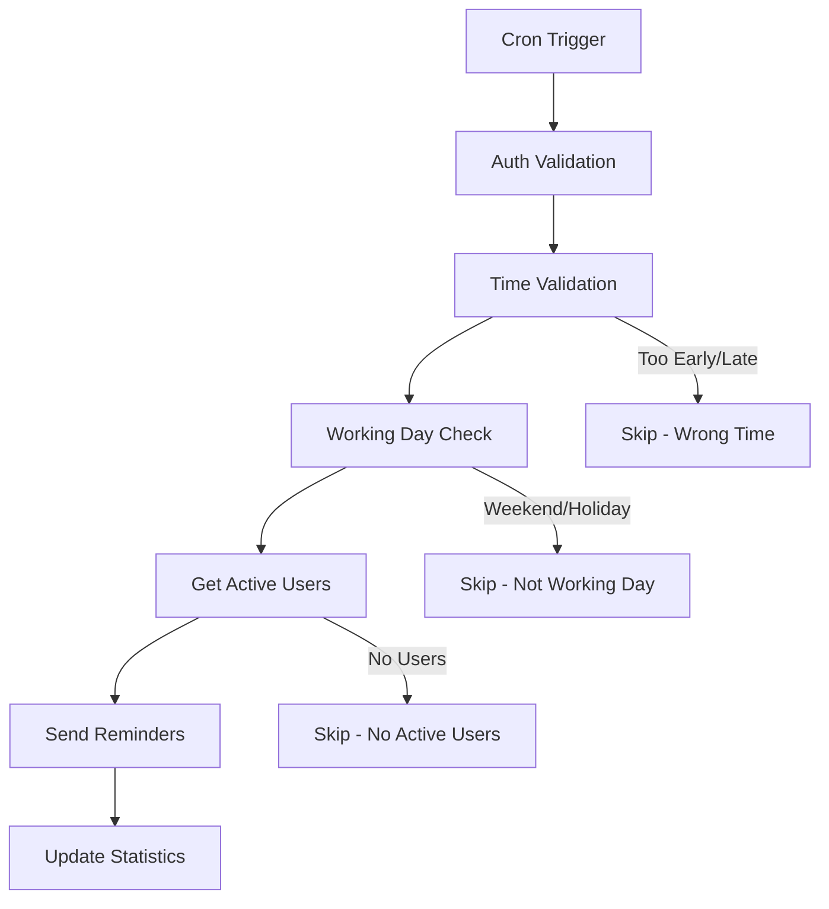
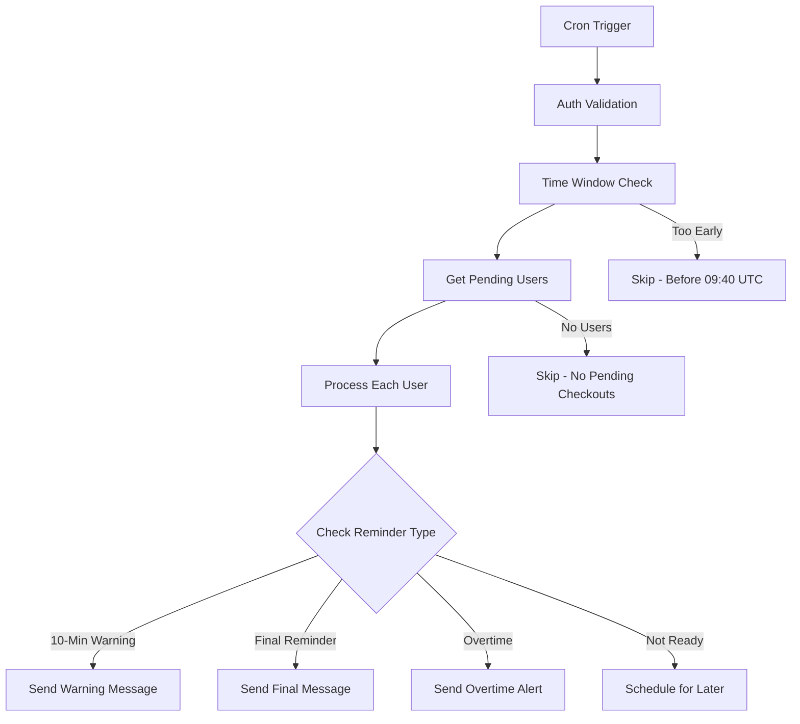

# Cron Jobs Documentation

## Overview

This document covers the automated cron job system for attendance reminders in the Bun LINE T3 application. The system includes two main cron jobs that send LINE notifications to users for check-in and checkout reminders.

## Architecture

### System Components

```
┌─────────────────────┐    ┌─────────────────────┐    ┌─────────────────────┐
│   Cron Container    │───▶│   API Endpoints     │───▶│   LINE Messaging    │
│   (Docker/System)   │    │   (Next.js API)     │    │   (Push Messages)   │
└─────────────────────┘    └─────────────────────┘    └─────────────────────┘
          │                           │                           │
          ▼                           ▼                           ▼
┌─────────────────────┐    ┌─────────────────────┐    ┌─────────────────────┐
│   Schedule Config   │    │   Shared Utilities  │    │   User Notifications│
│   (crontab)         │    │   (Auth, Messaging) │    │   (LINE App)        │
└─────────────────────┘    └─────────────────────┘    └─────────────────────┘
```

### Shared Utilities

Our cron jobs use shared utilities for consistent behavior:

- **cron-auth.ts**: Authentication validation
- **line-messaging.ts**: LINE message sending utilities  
- **datetime.ts**: UTC/Bangkok timezone conversion
- **cron-response.ts**: Standardized API responses

## Cron Jobs

### 1. Check-in Reminder (`/api/cron/check-in-reminder`)

**Purpose**: Sends morning check-in reminders to encourage users to log their work start time.

**Schedule**: `0 1 * * 1-5` (01:00 UTC / 08:00 Bangkok, Monday-Friday)

**Features**:
- ✅ Working day validation (excludes weekends and Thai holidays)
- ✅ Time window validation (01:00-02:59 UTC for flexibility)
- ✅ Random friendly messages (20+ variations)
- ✅ Interactive LINE buttons for quick check-in
- ✅ User filtering (excludes users on leave)

**Flow**:


### 2. Enhanced Checkout Reminder (`/api/cron/enhanced-checkout-reminder`)

**Purpose**: Sends personalized checkout reminders based on individual check-in times and working hours.

**Schedule**: `*/5 9-13 * * 1-5` (Every 5 minutes, 09:00-13:59 UTC / 16:00-20:59 Bangkok, Monday-Friday)

**Features**:
- ✅ Dynamic timing based on check-in time
- ✅ Two-tier reminder system (10-minute warning + final reminder)
- ✅ Overtime detection and alerts
- ✅ Rich flex messages with work statistics
- ✅ Individual working hour preferences

**Reminder Types**:
1. **10-Minute Warning**: Sent 10 minutes before expected checkout
2. **Final Reminder**: Sent at expected checkout time
3. **Overtime Alert**: Sent when working beyond expected hours

**Flow**:


## Configuration

### Environment Variables

```bash
# Required for all cron jobs
CRON_SECRET=your_secure_secret_here

# LINE Integration
LINE_CHANNEL_ACCESS=your_line_access_token
LINE_MESSAGING_API=https://api.line.me/v2/bot/message

# Application Environment
APP_ENV=production  # Enables time validation
NODE_ENV=production
```

### Cron Schedule (Docker)

```bash
# Check-in reminder - 8 AM Bangkok (Monday-Friday)
0 1 * * 1-5 curl -H "Authorization: Bearer $CRON_SECRET" http://app:12914/api/cron/check-in-reminder

# Enhanced checkout reminder - Every 5 minutes (4:40-8:00 PM Bangkok, Monday-Friday)  
*/5 9-13 * * 1-5 curl -H "Authorization: Bearer $CRON_SECRET" http://app:12914/api/cron/enhanced-checkout-reminder

# Auto checkout - Midnight cleanup
0 0 * * * curl -H "Authorization: Bearer $CRON_SECRET" http://app:12914/api/cron/auto-checkout
```

## API Reference

### Check-in Reminder Endpoint

```http
GET /api/cron/check-in-reminder
Authorization: Bearer {CRON_SECRET}
```

**Response Examples**:

```json
// Success
{
  "success": true,
  "message": "Check-in reminder push sent successfully",
  "messageText": "สวัสดีตอนเช้า! พร้อมเริ่มต้นวันใหม่แล้วใช่ไหม?",
  "sentUserCount": 5,
  "failedUserCount": 0,
  "timestamp": "2025-01-07T01:00:00.000Z"
}

// Skipped - Weekend
{
  "success": true,
  "message": "Skipped - not a working day",
  "timestamp": "2025-01-05T01:00:00.000Z"
}

// Skipped - Holiday
{
  "success": true,
  "message": "Skipped - public holiday: วันขึ้นปีใหม่ (New Year's Day)",
  "holidayInfo": {
    "nameThai": "วันขึ้นปีใหม่",
    "nameEnglish": "New Year's Day",
    "type": "public"
  },
  "timestamp": "2025-01-01T01:00:00.000Z"
}
```

### Enhanced Checkout Reminder Endpoint

```http
GET /api/cron/enhanced-checkout-reminder
Authorization: Bearer {CRON_SECRET}
```

**Response Example**:

```json
{
  "success": true,
  "message": "Checkout reminders processed: 3 sent (2 x 10min, 1 x final), 5 scheduled, 0 failed, 2 skipped",
  "timestamp": "2025-01-07T10:00:00.000Z",
  "currentUTCTime": "2025-01-07T10:00:00.000Z",
  "statistics": {
    "total": 10,
    "sent": 3,
    "sent10Min": 2,
    "sentFinal": 1,
    "scheduled": 5,
    "failed": 0,
    "skipped": 2
  },
  "results": [...]
}
```

## Shared Utilities API

### Authentication (`cron-auth.ts`)

```typescript
// Detailed validation for structured responses
function validateCronAuth(req: NextRequest): AuthResult {
  // Returns: { success: boolean, error?: string, status?: number }
}

// Simple validation for boolean responses  
function validateSimpleCronAuth(authHeader: string | null): boolean {
  // Returns: true if valid, false otherwise
}
```

### LINE Messaging (`line-messaging.ts`)

```typescript
// Send push message to LINE user
async function sendPushMessage(userId: string, messages: any[]): Promise<Response>

// Create flex carousel message
function createFlexCarousel(bubbleItems: any[]): any[]
```

### Date/Time (`datetime.ts`)

```typescript
// Get true UTC time (corrected implementation)
function getCurrentUTCTime(): Date

// Convert UTC to Bangkok timezone
function convertUTCToBangkok(utcDate: Date): Date

// Format UTC time as Bangkok time string (HH:MM)
function formatUTCTimeAsThaiTime(utcDate: Date): string
```

## Security

### Authentication
- All cron endpoints require `Authorization: Bearer {CRON_SECRET}` header
- Validates against environment variable `CRON_SECRET`
- Returns 401 Unauthorized for invalid/missing tokens

### Rate Limiting
- Implemented via `RateLimiter.checkCronRateLimit()`
- Prevents abuse and ensures system stability
- Configurable limits per endpoint

### Input Validation
- All user inputs validated using Zod schemas
- Database queries use parameterized statements
- LINE message content sanitized

## Monitoring

### Logging
- Structured console logging with emojis for visibility
- Request/response logging for debugging
- Error tracking with detailed messages

### Health Checks
- Docker health checks verify container status
- API endpoint availability monitoring
- Database connection validation

### Metrics
- Success/failure rates tracked per job
- User engagement metrics (reminder response rates)
- Performance metrics (execution time, memory usage)

## Troubleshooting

### Common Issues

**1. Missing Reminders**
```bash
# Check if cron container is running
docker ps | grep cron

# Verify cron schedule
docker exec cron-container crontab -l

# Check application logs
docker logs bun-line-t3-app

# Test API endpoint manually
curl -H "Authorization: Bearer $CRON_SECRET" \
     http://localhost:12914/api/cron/check-in-reminder
```

**2. Wrong Timing**
- Verify `APP_ENV=production` for time validation
- Check timezone settings: `TZ=Asia/Bangkok`
- Validate UTC time calculation with `getCurrentUTCTime()`

**3. LINE Message Failures**  
- Verify `LINE_CHANNEL_ACCESS` token validity
- Check LINE Messaging API quotas and limits
- Validate user LINE IDs in database

**4. Authentication Errors**
- Ensure `CRON_SECRET` is set in environment
- Verify secret matches between cron job and API
- Check authorization header format: `Bearer {secret}`

### Debug Commands

```bash
# Test check-in reminder
curl -v -H "Authorization: Bearer $CRON_SECRET" \
     http://localhost:12914/api/cron/check-in-reminder

# Test checkout reminder  
curl -v -H "Authorization: Bearer $CRON_SECRET" \
     http://localhost:12914/api/cron/enhanced-checkout-reminder

# Check cron job status
docker exec cron-container ps aux | grep cron

# View detailed logs
docker logs -f bun-line-t3-app | grep -E "(cron|reminder)"
```

## Development

### Local Testing
```bash
# Start development server
bun run dev

# Test endpoints (development mode skips time validation)
curl -H "Authorization: Bearer test-secret" \
     http://localhost:4325/api/cron/check-in-reminder
```

### Adding New Cron Jobs
1. Create new API endpoint in `/api/cron/`
2. Use shared utilities from `/lib/utils/cron-*`
3. Add authentication with `validateCronAuth()` or `validateSimpleCronAuth()`
4. Implement proper error handling and logging
5. Add to Docker crontab configuration
6. Update documentation

### Testing
```bash
# Run timezone tests
bun test timezone

# Run all tests
bun test

# Lint code
bun run lint
```

## Recent Changes

### v2.0.1 - UTC Timezone Fix & Refactoring (Latest)
- ✅ **Fixed**: `getCurrentUTCTime()` now returns actual UTC instead of local time
- ✅ **Refactored**: Extracted shared utilities for better code reusability
- ✅ **Enhanced**: Improved error handling and response standardization
- ✅ **Added**: Comprehensive logging and monitoring capabilities

### Migration Notes
- **Breaking**: `getCurrentUTCTime()` behavior changed - now returns true UTC
- **Improved**: All timezone calculations use proper APIs instead of manual offsets
- **New**: Shared utilities available for other cron jobs

---

*Last updated: January 7, 2025*  
*Version: 2.0.1*