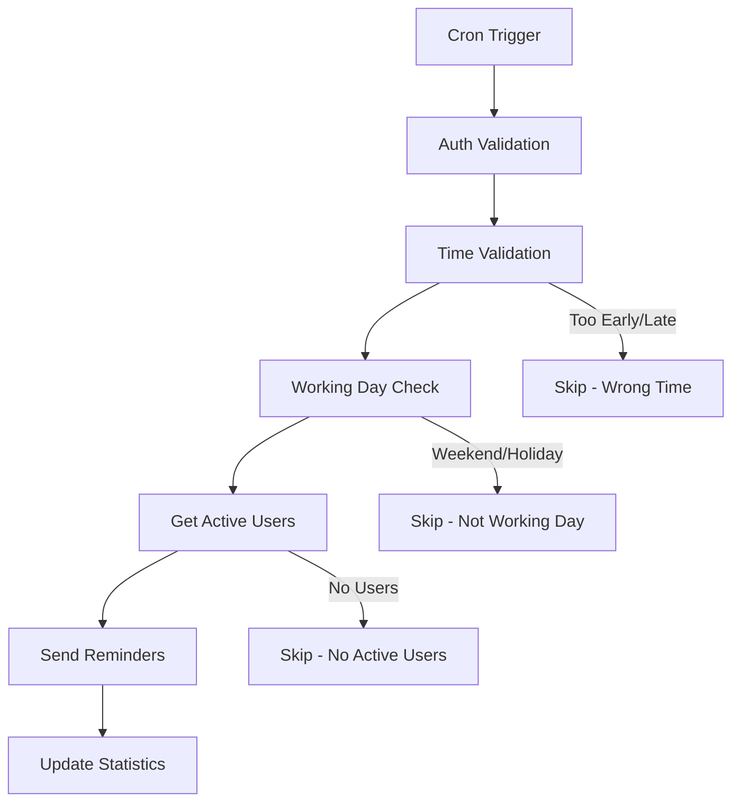
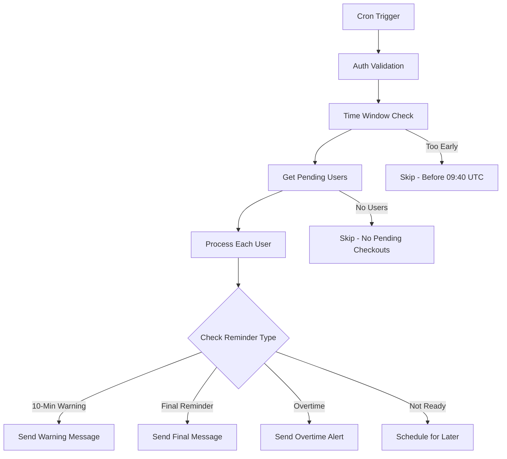

# Cron Jobs Documentation

## Overview

This document covers the automated cron job system in the Bun LINE T3
application, including attendance reminders, automatic checkout and image
cleanup. Runtime schedules are managed from PostgreSQL through the admin page.

## Architecture

### System Components

```
┌─────────────────────┐    ┌─────────────────────┐    ┌─────────────────────┐
│   Cron Container    │───▶│   API Endpoints     │───▶│   LINE Messaging    │
│   (Docker/System)   │    │ (TanStack Start API)│    │   (Push Messages)   │
└─────────────────────┘    └─────────────────────┘    └─────────────────────┘
          │                           │                           │
          ▼                           ▼                           ▼
┌─────────────────────┐    ┌─────────────────────┐    ┌─────────────────────┐
│   Wake-up Trigger   │    │   Shared Utilities  │    │   User Notifications│
│   (crontab)         │    │   (Auth, Messaging) │    │   (LINE App)        │
└─────────────────────┘    └─────────────────────┘    └─────────────────────┘
```

Individual schedules and execution history are stored in PostgreSQL. The
container crontab only triggers the dispatcher and is deliberately not a job
registry.

### Shared Utilities

Our cron jobs use shared utilities for consistent behavior:

- **cron-auth.ts**: Authentication validation
- **line-messaging.ts**: LINE message sending utilities
- **datetime.ts**: UTC/Bangkok timezone conversion
- **cron-response.ts**: Standardized API responses

## Cron Jobs

### 1. Check-in Reminder (`/api/cron/check-in-reminder`)

**Purpose**: Sends morning check-in reminders to encourage users to log their work start time.

**Schedule**: `0 8 * * 1-5` (08:00 Bangkok, Monday-Friday)

**Features**:

- ✅ Working day validation (excludes weekends and Thai holidays)
- ✅ Time window validation (01:00-02:59 UTC for flexibility)
- ✅ Random friendly messages (20+ variations)
- ✅ Interactive LINE buttons for quick check-in
- ✅ User filtering (excludes users on leave)

**Flow**:


```mermaid
flowchart TD
    A[Cron Trigger] --> B[Auth Validation]
    B --> C[Time Validation]
    C --> D[Working Day Check]
    D --> E[Get Active Users]
    E --> F[Send Reminders]
    F --> G[Update Statistics]

    C -->|Too Early/Late| H[Skip - Wrong Time]
    D -->|Weekend/Holiday| I[Skip - Not Working Day]
    E -->|No Users| J[Skip - No Active Users]
```

### 2. Enhanced Checkout Reminder (`/api/cron/enhanced-checkout-reminder`)

**Purpose**: Sends personalized checkout reminders based on individual check-in times and working hours.

**Schedule**: `*/5 16-20 * * 1-5` (Every 5 minutes, 16:00-20:59 Bangkok, Monday-Friday)

**Features**:

- ✅ Dynamic timing based on check-in time
- ✅ Two-tier reminder system (10-minute warning + final reminder)
- ✅ Overtime detection and alerts
- ✅ Rich flex messages with work statistics
- ✅ Individual working hour preferences

**Reminder Types**:

1. **10-Minute Warning**: Sent 10 minutes before expected checkout
2. **Final Reminder**: Sent at expected checkout time
3. **Overtime Alert**: Sent when working beyond expected hours

**Flow**:


```mermaid
flowchart TD
    A[Cron Trigger] --> B[Auth Validation]
    B --> C[Time Window Check]
    C --> D[Get Pending Users]
    D --> E[Process Each User]
    E --> F{Check Reminder Type}
    F -->|10-Min Warning| G[Send Warning Message]
    F -->|Final Reminder| H[Send Final Message]
    F -->|Overtime| I[Send Overtime Alert]
    F -->|Not Ready| J[Schedule for Later]

    C -->|Too Early| K[Skip - Before 09:40 UTC]
    D -->|No Users| L[Skip - No Pending Checkouts]
```

## Cron Jobs Management Integration

The admin page at `/cron-jobs` reads and manages jobs in the PostgreSQL
`cron_jobs` table. The container `crontab` is only a one-minute wake-up trigger;
it does not store individual schedules or enabled state. The registry at
`src/features/cron-jobs/constants/registry.ts` is seed/reference data for the
initial migration, not runtime source of truth:

- `check-in-reminder`
- `enhanced-checkout-reminder`
- `auto-checkout`
- `image-cleanup`

The page uses these protected endpoints:

- `GET /api/admin/cron-jobs` — list jobs, schedules and execution history
- `POST /api/admin/cron-jobs` — create a job
- `PATCH /api/admin/cron-jobs/:jobId` — edit a job or enable/disable it
- `DELETE /api/admin/cron-jobs/:jobId` — delete a job and its history
- `POST /api/admin/cron-jobs/:jobId/run` — manually invoke a job

The worker endpoint is separate from the admin API:

- `POST /api/cron/dispatch` — authenticated dispatcher called by the container

The dispatcher reads enabled rows from PostgreSQL, evaluates each cron
expression in `Asia/Bangkok`, claims the scheduled minute idempotently, invokes
the configured endpoint with `CRON_SECRET`, and records the result in
`cron_job_executions`.

### Failure diagnosis for automatic checkout

When `/api/cron/auto-checkout` cannot process one or more attendance records,
it returns HTTP 500 with an aggregated reason such as the database error or
the affected operation. The dispatcher stores that response message together
with the HTTP status in `cron_job_executions.message` and
`cron_job_executions.http_status`.

To investigate a failed run:

1. Open `/cron-jobs` and select `ลงชื่อออกงานอัตโนมัติ`.
2. Read `สาเหตุการรันล่าสุด` in the action dialog. The same reason is shown in
   the table row and the execution history status remains `ล้มเหลว`.
3. If the failure is a partial run, the message includes the number of failed
   users and groups identical reasons together. The response does not expose
   user identifiers in the aggregated diagnostic message.

Notification delivery problems are recorded as warnings separately. They do
not mark the attendance update as failed when the database checkout itself
has already succeeded.

Cron endpoints are server-to-server requests and do not have an interactive
browser session. Their access control is the `CRON_SECRET` bearer token; do
not add a user-session or LINE approval guard to the worker endpoint.

The migration is included at
`prisma/migrations/20261004120000_add_cron_job_management`. Before applying it
to another environment, confirm that `DATABASE_URL` points to the intended
database and use the appropriate migration command. Do not apply this
migration to production without a reviewed rollout and backup plan.

## Configuration

### Environment Variables

```bash
# Required for all cron jobs
CRON_SECRET=your_secure_secret_here
CRON_BASE_URL=http://app:12914

# LINE Integration
LINE_CHANNEL_ACCESS=your_line_access_token
LINE_MESSAGING_API=https://api.line.me/v2/bot/message

# Application Environment
APP_ENV=production  # Enables time validation
NODE_ENV=production
```

### Cron Schedule (Container image)

```bash
# The only active crontab entry. Individual schedules live in PostgreSQL.
* * * * * /usr/local/bin/cron-request.sh POST /api/cron/dispatch
```

## API Reference

### Check-in Reminder Endpoint

```http
GET /api/cron/check-in-reminder
Authorization: Bearer {CRON_SECRET}
```

**Response Examples**:

```json
// Success
{
  "success": true,
  "message": "Check-in reminder push sent successfully",
  "messageText": "สวัสดีตอนเช้า! พร้อมเริ่มต้นวันใหม่แล้วใช่ไหม?",
  "sentUserCount": 5,
  "failedUserCount": 0,
  "timestamp": "2025-01-07T01:00:00.000Z"
}

// Skipped - Weekend
{
  "success": true,
  "message": "Skipped - not a working day",
  "timestamp": "2025-01-05T01:00:00.000Z"
}

// Skipped - Holiday
{
  "success": true,
  "message": "Skipped - public holiday: วันขึ้นปีใหม่ (New Year's Day)",
  "holidayInfo": {
    "nameThai": "วันขึ้นปีใหม่",
    "nameEnglish": "New Year's Day",
    "type": "public"
  },
  "timestamp": "2025-01-01T01:00:00.000Z"
}
```

### Enhanced Checkout Reminder Endpoint

```http
GET /api/cron/enhanced-checkout-reminder
Authorization: Bearer {CRON_SECRET}
```

**Response Example**:

```json
{
  "success": true,
  "message": "Checkout reminders processed: 3 sent (2 x 10min, 1 x final), 5 scheduled, 0 failed, 2 skipped",
  "timestamp": "2025-01-07T10:00:00.000Z",
  "currentUTCTime": "2025-01-07T10:00:00.000Z",
  "statistics": {
    "total": 10,
    "sent": 3,
    "sent10Min": 2,
    "sentFinal": 1,
    "scheduled": 5,
    "failed": 0,
    "skipped": 2
  },
  "results": [...]
}
```

## Shared Utilities API

### Authentication (`cron-auth.ts`)

```typescript
// Detailed validation for structured responses
function validateCronAuth(req: Request): AuthResult {
  // Returns: { success: boolean, error?: string, status?: number }
}

// Simple validation for boolean responses
function validateSimpleCronAuth(authHeader: string | null): boolean {
  // Returns: true if valid, false otherwise
}
```

### LINE Messaging (`line-messaging.ts`)

```typescript
// Send push message to LINE user
async function sendPushMessage(
  userId: string,
  messages: any[],
): Promise<Response>;

// Create flex carousel message
function createFlexCarousel(bubbleItems: any[]): any[];
```

### Date/Time (`datetime.ts`)

```typescript
// Get true UTC time (corrected implementation)
function getCurrentUTCTime(): Date;

// Convert UTC to Bangkok timezone
function convertUTCToBangkok(utcDate: Date): Date;

// Format UTC time as Bangkok time string (HH:MM)
function formatUTCTimeAsThaiTime(utcDate: Date): string;
```

## Security

### Authentication

- All cron endpoints require `Authorization: Bearer {CRON_SECRET}` header
- Validates against environment variable `CRON_SECRET`
- Returns 401 Unauthorized for invalid/missing tokens

### Rate Limiting

- Implemented via `RateLimiter.checkCronRateLimit()`
- Prevents abuse and ensures system stability
- Configurable limits per endpoint

### Input Validation

- All user inputs validated using Zod schemas
- Database queries use parameterized statements
- LINE message content sanitized

## Monitoring

### Logging

- Structured console logging with emojis for visibility
- Request/response logging for debugging
- Error tracking with detailed messages

### Health Checks

- Docker health checks verify container status
- API endpoint availability monitoring
- Database connection validation

### Metrics

- Success/failure rates tracked per job
- User engagement metrics (reminder response rates)
- Performance metrics (execution time, memory usage)

### Local Apple Container simulation

The local development machine uses Apple Container rather than Docker. Build
and run the cron worker image with. When calling a host development server,
bind Vite to `0.0.0.0` so the container can reach it. The command below is a
safe request-shape check; it does not call an endpoint or touch the database:

```bash
# Terminal 1 - app server
bunx vite dev --port 4325 --host 0.0.0.0

# Terminal 2 - Apple Container (create the machine once)
container machine create alpine:3.22 --name cron-dev
container machine run -n cron-dev -- true
container build --tag bun-line-t3-cron-dev --file Dockerfile.cron --platform linux/arm64 .
container run --rm \
  -e CRON_SECRET=local-test \
  -e CRON_BASE_URL=http://192.168.64.1:4325 \
  -e CRON_DRY_RUN=1 \
  bun-line-t3-cron-dev:latest \
  /usr/local/bin/cron-request.sh POST /api/cron/dispatch
```

`192.168.64.1` is the Apple Container host gateway observed on the local
machine. `CRON_DRY_RUN=1` verifies method and endpoint without calling the app
or sending LINE messages. To exercise the DB-backed flow, first apply the
migration to an explicitly confirmed development database, start the app with
`DATABASE_URL` and `CRON_SECRET`, then omit `CRON_DRY_RUN` and point
`CRON_BASE_URL` at the development app. That path can invoke real business
logic and external LINE calls, so use non-production credentials.

## Troubleshooting

### Common Issues

**1. Missing Reminders**

```bash
# Check if cron container is running
docker ps | grep cron

# Verify cron schedule
docker exec cron-container crontab -l

# Check application logs
docker logs bun-line-t3-app

# Test API endpoint manually
curl -H "Authorization: Bearer $CRON_SECRET" \
     http://localhost:12914/api/cron/check-in-reminder
```

**2. Wrong Timing**

- Verify `APP_ENV=production` for time validation
- Check timezone settings: `TZ=Asia/Bangkok`
- Validate UTC time calculation with `getCurrentUTCTime()`

**3. LINE Message Failures**

- Verify `LINE_CHANNEL_ACCESS` token validity
- Check LINE Messaging API quotas and limits
- Validate user LINE IDs in database

**4. Authentication Errors**

- Ensure `CRON_SECRET` is set in environment
- Verify secret matches between cron job and API
- Check authorization header format: `Bearer {secret}`

### Debug Commands

```bash
# Test check-in reminder
curl -v -H "Authorization: Bearer $CRON_SECRET" \
     http://localhost:12914/api/cron/check-in-reminder

# Test checkout reminder
curl -v -H "Authorization: Bearer $CRON_SECRET" \
     http://localhost:12914/api/cron/enhanced-checkout-reminder

# Check cron job status
docker exec cron-container ps aux | grep cron

# View detailed logs
docker logs -f bun-line-t3-app | grep -E "(cron|reminder)"
```

## Development

### Local Testing

```bash
# Start development server
bun run dev

# Test endpoints (development mode skips time validation)
curl -H "Authorization: Bearer test-secret" \
     http://localhost:4325/api/cron/check-in-reminder
```

### Adding New Cron Jobs

1. Create the API endpoint in `/api/cron/`
2. Use shared utilities from `/lib/utils/cron-*`
3. Add authentication with `validateCronAuth()` or `validateSimpleCronAuth()`
4. Implement proper error handling and logging
5. Open `/cron-jobs` as an admin and create the job with its cron expression
6. Confirm the endpoint with a safe manual run in development
7. Do not add another per-job line to `crontab`; the dispatcher reads the row

### Testing

```bash
# Run timezone tests
bun test timezone

# Run all tests
bun test

# Lint code
bun run lint
```

## Recent Changes

### v2.0.1 - UTC Timezone Fix & Refactoring (Latest)

- ✅ **Fixed**: `getCurrentUTCTime()` now returns actual UTC instead of local time
- ✅ **Refactored**: Extracted shared utilities for better code reusability
- ✅ **Enhanced**: Improved error handling and response standardization
- ✅ **Added**: Comprehensive logging and monitoring capabilities

### Migration Notes

- **Breaking**: `getCurrentUTCTime()` behavior changed - now returns true UTC
- **Improved**: All timezone calculations use proper APIs instead of manual offsets
- **New**: Shared utilities available for other cron jobs

---

_Last updated: January 7, 2025_  
_Version: 2.0.1_
