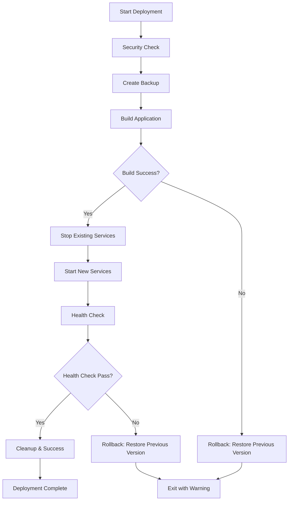

# 🔄 Rollback Deployment System Documentation

## 📋 Overview | ภาพรวม

ระบบ rollback อัตโนมัติสำหรับ GitHub Actions deployment pipeline ที่ออกแบบมาเพื่อให้การ deployment มีความปลอดภัยและเสถียรภาพสูง โดยสามารถกลับไปใช้ version เดิมที่ทำงานได้เมื่อ deployment ใหม่ล้มเหลว

## 🛡️ Security-First Approach | แนวทางที่เน้นความปลอดภัย

### 🔐 Core Security Principles | หลักการความปลอดภัยหลัก

- **Defense in Depth**: หลายชั้นการป้องกันตั้งแต่ build, health check, จนถึง rollback
- **Zero Downtime**: ลดเวลาที่บริการหยุดทำงานให้น้อยที่สุด
- **Data Protection**: ป้องกันการสูญหายของข้อมูลและการตั้งค่า
- **Automated Recovery**: กู้คืนอัตโนมัติโดยไม่ต้องการการแทรกแซงจากผู้ใช้

## 🏗️ System Architecture | สถาปัตยกรรมระบบ

### 📊 Deployment Pipeline Flow



### 🔄 Rollback Trigger Points | จุดเรียก Rollback

1. **Build Failure**: เมื่อ Docker build ล้มเหลว
2. **Service Startup Failure**: เมื่อ containers ไม่สามารถเริ่มทำงานได้
3. **Health Check Failure**: เมื่อ application ไม่ตอบสนองหลังเริ่มงาน

## 🚀 Implementation Details | รายละเอียดการใช้งาน

### 1. 💾 Backup Creation | การสร้างสำรอง

```yaml
- name: 💾 Create Backup of Current State
  run: |
    # สร้าง backup directory with timestamp
    BACKUP_DIR="/tmp/backup-$(date +%Y%m%d-%H%M%S)"
    mkdir -p "$BACKUP_DIR"
    
    # Backup current docker images
    if docker images | grep -q "bun-line-t3"; then
      docker save -o "$BACKUP_DIR/current-images.tar" \
        $(docker images --format "{{.Repository}}:{{.Tag}}" | grep "bun-line-t3" | head -5)
    fi
    
    # Save backup path for later use
    echo "BACKUP_DIR=$BACKUP_DIR" >> $GITHUB_ENV
```

**Security Features:**
- ✅ Timestamped backups เพื่อป้องกันการ conflict
- ✅ เก็บเฉพาะ images ที่จำเป็น (5 versions ล่าสุด)
- ✅ ตรวจสอบความมีอยู่ของ backup ก่อนใช้งาน

### 2. 🏗️ Secure Build Process | กระบวนการ Build ที่ปลอดภัย

```yaml
- name: 🏗️ Build Application
  id: build_app
  continue-on-error: true
  run: |
    if docker-compose build $BUILD_ARGS \
      --build-arg DATABASE_URL="${{ secrets.DATABASE_URL }}" \
      --build-arg NEXTAUTH_URL="${{ secrets.NEXTAUTH_URL }}" \
      --build-arg NEXTAUTH_SECRET="${{ secrets.NEXTAUTH_SECRET }}"; then
      echo "BUILD_SUCCESS=true" >> $GITHUB_OUTPUT
    else
      echo "BUILD_SUCCESS=false" >> $GITHUB_OUTPUT
      exit 1
    fi
```

**Security Features:**
- ✅ Isolated build environment
- ✅ Secure handling ของ build arguments
- ✅ Output tracking สำหรับการตัดสินใจ rollback

### 3. 🏥 Health Check System | ระบบตรวจสอบสุขภาพ

```yaml
- name: 🏥 Quick Health Check After Startup
  id: health_check
  continue-on-error: true
  run: |
    # Wait for services to be ready
    sleep 20
    
    # Check if containers are running
    if ! docker-compose ps | grep -q "Up"; then
      echo "HEALTH_CHECK_PASSED=false" >> $GITHUB_OUTPUT
      exit 1
    fi
    
    # Test basic connectivity with retries
    MAX_ATTEMPTS=5
    ATTEMPT=1
    
    while [[ $ATTEMPT -le $MAX_ATTEMPTS ]]; do
      if curl -f -s -m 10 "http://localhost:$PORT/api/health" > /dev/null 2>&1; then
        echo "HEALTH_CHECK_PASSED=true" >> $GITHUB_OUTPUT
        exit 0
      fi
      sleep 5
      ((ATTEMPT++))
    done
    
    echo "HEALTH_CHECK_PASSED=false" >> $GITHUB_OUTPUT
    exit 1
```

**Security Features:**
- ✅ Multiple validation layers (container status + endpoint health)
- ✅ Configurable retry mechanism
- ✅ Timeout protection เพื่อป้องกัน infinite loops
- ✅ Safe failure handling

### 4. 🔄 Automated Rollback Process | กระบวนการ Rollback อัตโนมัติ

```yaml
- name: 🔄 Rollback on Startup or Health Check Failure
  if: steps.health_check.outcome == 'failure' || steps.start_services.outcome == 'failure'
  run: |
    # Stop current failed deployment
    docker-compose down --timeout 30 || true
    
    # Restore previous Docker images
    if [[ -f "$BACKUP_DIR/current-images.tar" ]]; then
      docker load -i "$BACKUP_DIR/current-images.tar"
      
      # Restart services with previous images
      docker-compose up -d
      
      # Verify rollback success
      sleep 15
      if docker-compose ps | grep -q "Up"; then
        echo "✅ Rollback completed successfully"
        
        # Quick verification
        if curl -f -s -m 10 "http://localhost:$PORT/api/health" > /dev/null 2>&1; then
          echo "✅ Rollback verification: Application is healthy"
        fi
      fi
    fi
```

**Security Features:**
- ✅ Graceful shutdown ของ failed deployment
- ✅ Atomic rollback operation
- ✅ Verification ของ rollback success
- ✅ Fallback handling เมื่อไม่มี backup

## 📋 Rollback Scenarios | สถานการณ์ Rollback

### Scenario 1: Build Failure | Build ล้มเหลว

**Trigger**: Docker build ล้มเหลว
**Action**: 
- แสดง error message ที่ชัดเจน
- กลับไปใช้ previous working version (ถ้ามี)
- ออกด้วย warning status (ไม่ใช่ error เพราะมี rollback)

### Scenario 2: Service Startup Failure | บริการเริ่มไม่ได้

**Trigger**: Docker containers ไม่สามารถเริ่มทำงานได้
**Action**:
- หยุด failed containers
- โหลด previous Docker images
- เริ่มบริการด้วย previous version
- ตรวจสอบว่า rollback สำเร็จ

### Scenario 3: Health Check Failure | Health Check ล้มเหลว

**Trigger**: Application endpoint ไม่ตอบสนองหลังหลายครั้งพยายาม
**Action**:
- หยุด current deployment
- กลับไปใช้ previous version
- ตรวจสอบว่า previous version ทำงานได้
- รายงานผลการ rollback

## ⚡ Performance Optimization | การเพิ่มประสิทธิภาพ

### 🔄 Backup Management | การจัดการ Backup

```yaml
- name: 🧹 Cleanup Old Backup
  if: steps.health_check.outputs.HEALTH_CHECK_PASSED == 'true'
  run: |
    # Keep only the 3 most recent backups
    find /tmp -name "backup-*" -type d -mtime +1 | head -n -3 | xargs rm -rf || true
```

**Benefits:**
- ✅ ประหยัดพื้นที่ disk
- ✅ เก็บ backups ที่จำเป็นไว้ 3 versions
- ✅ Automatic cleanup เมื่อ deployment สำเร็จ

### 📊 Resource Monitoring | การตรวจสอบทรัพยากร

```yaml
- name: 🎉 Deployment Success Summary
  run: |
    echo "🐳 Container Status:"
    docker-compose ps --format "table {{.Name}}\t{{.State}}\t{{.Ports}}"
    
    echo "📊 Resource Usage:"
    docker stats --no-stream --format "table {{.Container}}\t{{.CPUPerc}}\t{{.MemUsage}}"
```

## 🔐 Security Considerations | ข้อพิจารณาด้านความปลอดภัย

### 🛡️ Backup Security | ความปลอดภัยของ Backup

- **Temporary Storage**: Backups ถูกเก็บใน `/tmp` ที่จะถูกลบเมื่อ reboot
- **Limited Retention**: เก็บเฉพาะ 3 versions ล่าสุด
- **Secure Deletion**: ใช้ secure file deletion สำหรับ sensitive files

### 🔍 Audit Trail | การตรวจสอบย้อนหลัง

- **Timestamped Logs**: ทุก action มี timestamp และ commit hash
- **Status Tracking**: บันทึกสถานะของทุกขั้นตอน
- **Error Reporting**: รายงาน errors โดยไม่เปิดเผยข้อมูลสำคัญ

### 🚨 Failure Handling | การจัดการความล้มเหลว

```yaml
# Mark as warning (deployment failed but rollback succeeded)
echo "::warning::Deployment failed but rollback completed successfully"
```

- **Graceful Degradation**: ระบบยังคงทำงานได้แม้ deployment ล้มเหลว
- **Clear Communication**: แจ้งสถานะที่ชัดเจนให้ทีมพัฒนา
- **Non-Breaking Failures**: Rollback ไม่ทำให้ system crash

## 📚 Best Practices | แนวทางปฏิบัติที่ดี

### ✅ Pre-deployment | ก่อน Deployment

1. **Always backup** current state ก่อนเริ่ม deployment
2. **Validate environment** variables และ secrets
3. **Check system resources** (memory, disk space)
4. **Clean up** old Docker images และ containers

### ✅ During Deployment | ระหว่าง Deployment

1. **Monitor each step** ด้วย output tracking
2. **Use timeouts** เพื่อป้องกัน infinite waits
3. **Implement retries** สำหรับ network operations
4. **Log everything** โดยไม่เปิดเผยข้อมูลสำคัญ

### ✅ Post-deployment | หลัง Deployment

1. **Comprehensive health checks** ทั้ง technical และ functional
2. **Resource monitoring** เพื่อตรวจสอบ performance
3. **Clean up** temporary files และ old backups
4. **Document** ผลการ deployment

## 🚀 Future Enhancements | การพัฒนาในอนาคต

### 📧 Notification System | ระบบแจ้งเตือน

- **LINE Notify** integration สำหรับแจ้งสถานะ deployment
- **Slack/Discord** webhooks สำหรับทีมพัฒนา
- **Email alerts** สำหรับ critical failures

### 📊 Advanced Monitoring | การตรวจสอบขั้นสูง

- **Database connectivity tests** หลัง deployment
- **API endpoint validation** ด้วย automated tests
- **Performance benchmarking** เปรียบเทียบก่อนและหลัง deployment

### 🔄 Blue-Green Deployment | การ Deploy แบบ Blue-Green

- **Zero-downtime** deployments
- **Instant rollback** โดยการสลับ traffic
- **A/B testing** capabilities

## 📞 Troubleshooting | การแก้ไขปัญหา

### ❌ Common Issues | ปัญหาที่พบบ่อย

#### 1. Backup Creation Failed
```bash
# ตรวจสอบพื้นที่ disk
df -h /tmp

# ตรวจสอบ Docker images
docker images | grep bun-line-t3
```

#### 2. Health Check Always Fails
```bash
# ตรวจสอบ application logs
docker-compose logs --tail=50

# ทดสอบ endpoint โดยตรง
curl -v http://localhost:4325/api/health
```

#### 3. Rollback Failed
```bash
# ตรวจสอบ backup files
ls -la /tmp/backup-*

# Manual rollback
docker load -i /tmp/backup-latest/current-images.tar
docker-compose up -d
```

---

## 📝 Summary | สรุป

ระบบ rollback ที่พัฒนาขึ้นให้การป้องกันที่ครอบคลุมสำหรับ deployment process ด้วย:

- ✅ **Automated backup** ก่อนทุก deployment
- ✅ **Multi-layer health checking** 
- ✅ **Instant rollback** เมื่อเกิดปัญหา
- ✅ **Security-first approach** ในทุกขั้นตอน
- ✅ **Comprehensive logging** สำหรับ debugging
- ✅ **Resource optimization** ด้วย automatic cleanup

ระบบนี้ช่วยให้การ deployment มีความเสถียรและปลอดภัยสูง โดยลดความเสี่ยงในการที่ application จะหยุดทำงานจาก deployment ที่ล้มเหลว

**💡 Remember**: ความปลอดภัยเป็นสิ่งสำคัญที่สุด - เมื่อมีข้อสงสัย ให้เลือกตัวเลือกที่ปลอดภัยกว่าเสมอ
