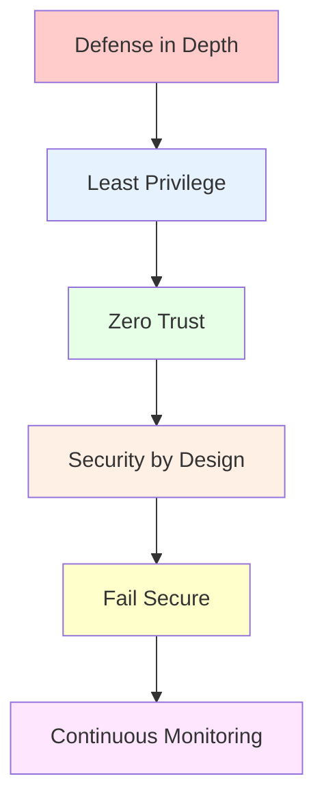

```mermaid
graph TD
    subgraph network [Network Layer]
        A1[HTTPS/TLS 1.3]
        A2[Security Headers]
        A3[Rate Limiting]
        A4[CORS Policy]
    end

    subgraph gateway [Application Gateway]
        B1[Input Validation]
        B2[Request Filtering]
        B3[DDoS Protection]
    end

    subgraph auth [Authentication Layer]
        C1[Multi-factor Auth]
        C2[Session Management]
        C3[Token Validation]
        C4[OAuth Integration]
    end

    subgraph authz [Authorization Layer]
        D1[Role-Based Access]
        D2[Permission Checks]
        D3[Resource Guards]
    end

    subgraph business [Business Logic Layer]
        E1[Input Sanitization]
        E2[Data Validation]
        E3[Business Rules]
        E4[Audit Logging]
    end

    subgraph data [Data Layer]
        F1[Encryption at Rest]
        F2[Parameterized Queries]
        F3[Access Controls]
        F4[Data Masking]
    end

    network --> gateway
    gateway --> auth
    auth --> authz
    authz --> business
    business --> data

    style network fill:#ffe6e6
    style gateway fill:#e6f3ff
    style auth fill:#e6ffe6
    style authz fill:#fff3e6
    style business fill:#f0e6ff
    style data fill:#e6ffff
```

# 🔐 คู่มือความปลอดภัย | Security Guide

> **🛡️ แนวทางการรักษาความปลอดภัยสำหรับระบบ Bun LINE T3 Attendance**
>
> **⚡ Security-First Architecture**: Defense in Depth + Zero Trust + Best Practices

## 📋 สารบัญ | Table of Contents

- [🌟 Security Philosophy](#-security-philosophy)
- [🛡️ Multi-Layer Security](#️-multi-layer-security)
- [🔐 Authentication & Authorization](#-authentication--authorization)
- [✅ Input Validation & Sanitization](#-input-validation--sanitization)
- [🔒 Cryptographic Security](#-cryptographic-security)
- [🌐 Network Security](#-network-security)
- [🗄️ Database Security](#️-database-security)
- [📝 Secure Coding Practices](#-secure-coding-practices)
- [🔍 Security Monitoring](#-security-monitoring)
- [🚨 Incident Response](#-incident-response)
- [✅ Security Checklist](#-security-checklist)

## 🌟 Security Philosophy

### 🏛️ Core Security Principles



#### 1. 🛡️ Defense in Depth (ป้องกันหลายชั้น)

- สร้างระบบป้องกันหลายชั้นเพื่อไม่พึ่งพาจุดป้องกันเดียว
- หากชั้นหนึ่งล้มเหลว ยังมีชั้นอื่นป้องกันต่อ

#### 2. 📊 Least Privilege (สิทธิ์ขั้นต่ำ)

- ให้สิทธิ์เฉพาะที่จำเป็นต่อการทำงาน
- ตรวจสอบและปรับปรุงสิทธิ์เป็นประจำ

#### 3. 🔍 Zero Trust (ไม่เชื่อใจใคร)

- ตรวจสอบทุกการเข้าถึงไม่ว่าจะมาจากไหน
- Verify and validate ทุก request

#### 4. 🏗️ Security by Design (ความปลอดภัยตั้งแต่เริ่มต้น)

- ออกแบบระบบด้วยความปลอดภัยเป็นหลัก
- ไม่เป็นสิ่งที่เพิ่มเติมภายหลัง

## 🛡️ Multi-Layer Security

### 🌐 Security Architecture Layers



## 🔐 Authentication & Authorization

### 🎫 Authentication Implementation

#### 1. NextAuth.js Integration

```typescript
// ✅ Secure authentication configuration
import NextAuth from "next-auth";
import LineProvider from "next-auth/providers/line";

export const authOptions: NextAuthOptions = {
  providers: [
    LineProvider({
      clientId: process.env.LINE_CLIENT_ID!,
      clientSecret: process.env.LINE_CLIENT_SECRET!,
      authorization: {
        params: {
          scope: "profile openid email",
          bot_prompt: "aggressive",
        },
      },
    }),
  ],

  session: {
    strategy: "jwt",
    maxAge: 24 * 60 * 60, // 24 hours
    updateAge: 60 * 60, // 1 hour
  },

  jwt: {
    secret: process.env.NEXTAUTH_SECRET,
    maxAge: 24 * 60 * 60, // 24 hours
  },

  callbacks: {
    async jwt({ token, user, account }) {
      // 🔐 Add user information to JWT
      if (user) {
        token.userId = user.id;
        token.role = user.role || "user";
      }
      return token;
    },

    async session({ session, token }) {
      // 🔒 Add user info to session
      session.user.id = token.userId as string;
      session.user.role = token.role as string;
      return session;
    },
  },

  pages: {
    signIn: "/auth/signin",
    signOut: "/auth/signout",
    error: "/auth/error",
  },
};
```

#### 2. Session Validation

```typescript
// ✅ Secure session validation utility
export async function validateSession(request: Request) {
  const session = await getServerSession(authOptions);

  if (!session || !session.user) {
    throw new SecurityError("UNAUTHORIZED", "Valid session required");
  }

  // 🔍 Additional session validation
  if (session.expires && new Date(session.expires) < new Date()) {
    throw new SecurityError("SESSION_EXPIRED", "Session has expired");
  }

  return session;
}

// ✅ API route protection
export async function protectedApiHandler(
  handler: (session: Session) => Promise<Response>,
) {
  try {
    const session = await validateSession();
    return await handler(session);
  } catch (error) {
    if (error instanceof SecurityError) {
      return NextResponse.json(
        { error: error.message },
        { status: error.status },
      );
    }
    return NextResponse.json(
      { error: "Internal server error" },
      { status: 500 },
    );
  }
}
```

### 🛡️ Authorization System

#### 1. Role-Based Access Control (RBAC)

```typescript
// ✅ Role definitions
enum UserRole {
  USER = "user",
  ADMIN = "admin",
  SYSTEM = "system",
}

enum Permission {
  READ_ATTENDANCE = "read:attendance",
  WRITE_ATTENDANCE = "write:attendance",
  ADMIN_USERS = "admin:users",
  SYSTEM_CONFIG = "system:config",
}

// ✅ Role-permission mapping
const rolePermissions: Record<UserRole, Permission[]> = {
  [UserRole.USER]: [Permission.READ_ATTENDANCE, Permission.WRITE_ATTENDANCE],
  [UserRole.ADMIN]: [
    Permission.READ_ATTENDANCE,
    Permission.WRITE_ATTENDANCE,
    Permission.ADMIN_USERS,
  ],
  [UserRole.SYSTEM]: [...Object.values(Permission)],
};

// ✅ Permission checking utility
export function hasPermission(user: User, permission: Permission): boolean {
  const userPermissions = rolePermissions[user.role] || [];
  return userPermissions.includes(permission);
}

// ✅ Authorization middleware
export function requirePermission(permission: Permission) {
  return async (session: Session) => {
    if (!hasPermission(session.user, permission)) {
      throw new SecurityError("FORBIDDEN", `Permission ${permission} required`);
    }
  };
}
```

#### 2. Resource-Level Authorization

```typescript
// ✅ Resource ownership validation
export async function canAccessAttendanceRecord(
  userId: string,
  recordId: string,
): Promise<boolean> {
  const record = await db.attendance.findUnique({
    where: { id: recordId },
    select: { userId: true },
  });

  if (!record) {
    throw new SecurityError("NOT_FOUND", "Attendance record not found");
  }

  return record.userId === userId;
}

// ✅ API handler with resource authorization
export async function GET(
  request: Request,
  { params }: { params: { recordId: string } },
) {
  const session = await validateSession(request);
  const { recordId } = params;

  // 🔒 Check resource access
  const canAccess = await canAccessAttendanceRecord(session.user.id, recordId);

  if (!canAccess) {
    return NextResponse.json({ error: "Access denied" }, { status: 403 });
  }

  // Proceed with request...
}
```

## ✅ Input Validation & Sanitization

### 🛡️ Runtime Validation with Zod

```typescript
import { z } from "zod";
import DOMPurify from "isomorphic-dompurify";

// ✅ Comprehensive validation schemas
const AttendanceSchema = z
  .object({
    action: z.enum(["check-in", "check-out"]),
    timestamp: z.string().datetime().optional(),
    location: z
      .string()
      .min(1, "Location cannot be empty")
      .max(100, "Location too long")
      .optional(),
    notes: z.string().max(500, "Notes too long").optional(),
  })
  .strict(); // Reject unknown properties

const UserInputSchema = z.object({
  name: z
    .string()
    .min(1, "Name required")
    .max(50, "Name too long")
    .regex(/^[a-zA-Z\s\u0E00-\u0E7F]+$/, "Invalid characters"),
  email: z.string().email("Invalid email format"),
  lineUserId: z
    .string()
    .regex(/^U[0-9a-f]{32}$/, "Invalid LINE User ID format")
    .optional(),
});

// ✅ Sanitization utilities
export function sanitizeString(input: string): string {
  // Remove potentially dangerous characters
  return DOMPurify.sanitize(input, {
    ALLOWED_TAGS: [],
    ALLOWED_ATTR: [],
  });
}

export function sanitizeHtml(input: string): string {
  return DOMPurify.sanitize(input, {
    ALLOWED_TAGS: ["b", "i", "em", "strong", "p", "br"],
    ALLOWED_ATTR: [],
  });
}

// ✅ Validation middleware
export function validateInput<T>(schema: z.ZodSchema<T>) {
  return (input: unknown): T => {
    try {
      return schema.parse(input);
    } catch (error) {
      if (error instanceof z.ZodError) {
        throw new SecurityError(
          "VALIDATION_ERROR",
          "Invalid input data",
          error.errors,
        );
      }
      throw error;
    }
  };
}
```

### 🔍 SQL Injection Prevention

```typescript
// ✅ Always use Prisma ORM - prevents SQL injection
export const attendanceService = {
  async findByUserId(userId: string): Promise<Attendance[]> {
    // ✅ Parameterized query via Prisma
    return await db.attendance.findMany({
      where: {
        userId: userId, // Automatically escaped
      },
      orderBy: {
        checkInTime: "desc",
      },
    });
  },

  // ❌ NEVER do raw queries with user input
  // const result = await db.$queryRaw`
  //   SELECT * FROM attendance WHERE userId = ${userId}
  // ` // This is vulnerable!

  // ✅ If raw queries needed, use typed parameters
  async rawQueryExample(userId: string) {
    return await db.$queryRaw`
      SELECT * FROM attendance 
      WHERE userId = ${userId}
      AND createdAt > NOW() - INTERVAL 30 DAY
    `;
  },
};
```

## 🔒 Cryptographic Security

### 🔐 Secure Random Generation

```typescript
import crypto from "crypto";

// ✅ Cryptographically secure random generation
export const cryptoSecure = {
  // Generate secure random bytes
  generateRandomBytes(length: number): Buffer {
    return crypto.randomBytes(length);
  },

  // Generate secure random string
  generateRandomString(length: number): string {
    const bytes = crypto.randomBytes(Math.ceil((length * 3) / 4));
    return bytes
      .toString("base64")
      .slice(0, length)
      .replace(/\+/g, "-")
      .replace(/\//g, "_")
      .replace(/=/g, "");
  },

  // Generate API key
  generateApiKey(): string {
    return this.generateRandomString(32);
  },

  // Generate session token
  generateSessionToken(): string {
    return this.generateRandomString(64);
  },
};

// ✅ Character set selection with rejection sampling
const CHARSETS = {
  ALPHANUMERIC:
    "ABCDEFGHIJKLMNOPQRSTUVWXYZabcdefghijklmnopqrstuvwxyz0123456789",
  NUMERIC: "0123456789",
  BASE64_URL_SAFE:
    "ABCDEFGHIJKLMNOPQRSTUVWXYZabcdefghijklmnopqrstuvwxyz0123456789-_",
} as const;

export function selectRandomChar(charset: string): string {
  const maxValidValue = Math.floor(256 / charset.length) * charset.length - 1;

  let randomByte;
  do {
    randomByte = crypto.randomBytes(1)[0];
  } while (randomByte > maxValidValue);

  return charset[randomByte % charset.length];
}

export function generateSecureString(length: number, charset: string): string {
  return Array.from({ length }, () => selectRandomChar(charset)).join("");
}
```

### 🔑 Password and Token Security

```typescript
import bcrypt from "bcrypt";
import jwt from "jsonwebtoken";

// ✅ Password hashing
export const passwordSecurity = {
  async hashPassword(password: string): Promise<string> {
    const saltRounds = 12; // Increase for higher security
    return await bcrypt.hash(password, saltRounds);
  },

  async verifyPassword(password: string, hash: string): Promise<boolean> {
    return await bcrypt.compare(password, hash);
  },
};

// ✅ JWT token security
export const tokenSecurity = {
  generateToken(payload: object, expiresIn: string = "1h"): string {
    return jwt.sign(payload, process.env.JWT_SECRET!, {
      expiresIn,
      algorithm: "HS256",
      issuer: "bun-line-t3",
      audience: "bun-line-t3-users",
    });
  },

  verifyToken(token: string): any {
    try {
      return jwt.verify(token, process.env.JWT_SECRET!, {
        algorithms: ["HS256"],
        issuer: "bun-line-t3",
        audience: "bun-line-t3-users",
      });
    } catch (error) {
      throw new SecurityError("INVALID_TOKEN", "Token verification failed");
    }
  },
};
```

### 🔐 Data Encryption

```typescript
import crypto from "crypto";

// ✅ AES encryption for sensitive data
export const dataEncryption = {
  algorithm: "aes-256-gcm" as const,

  encrypt(
    text: string,
    key: string,
  ): { encrypted: string; iv: string; tag: string } {
    const iv = crypto.randomBytes(16);
    const keyBuffer = crypto.createHash("sha256").update(key).digest();
    const cipher = crypto.createCipherGCM(this.algorithm, keyBuffer, iv);

    let encrypted = cipher.update(text, "utf8", "hex");
    encrypted += cipher.final("hex");

    const tag = cipher.getAuthTag();

    return {
      encrypted,
      iv: iv.toString("hex"),
      tag: tag.toString("hex"),
    };
  },

  decrypt(
    encryptedData: { encrypted: string; iv: string; tag: string },
    key: string,
  ): string {
    const keyBuffer = crypto.createHash("sha256").update(key).digest();
    const decipher = crypto.createDecipherGCM(
      this.algorithm,
      keyBuffer,
      Buffer.from(encryptedData.iv, "hex"),
    );

    decipher.setAuthTag(Buffer.from(encryptedData.tag, "hex"));

    let decrypted = decipher.update(encryptedData.encrypted, "hex", "utf8");
    decrypted += decipher.final("utf8");

    return decrypted;
  },
};
```

## 🌐 Network Security

### 🛡️ Security Headers

```typescript
// ✅ Security headers configuration
export function securityHeaders(): Headers {
  const headers = new Headers();

  // Prevent clickjacking
  headers.set("X-Frame-Options", "DENY");

  // Prevent MIME sniffing
  headers.set("X-Content-Type-Options", "nosniff");

  // XSS Protection
  headers.set("X-XSS-Protection", "1; mode=block");

  // Referrer Policy
  headers.set("Referrer-Policy", "strict-origin-when-cross-origin");

  // Content Security Policy
  headers.set(
    "Content-Security-Policy",
    [
      "default-src 'self'",
      "script-src 'self' 'unsafe-inline' 'unsafe-eval'",
      "style-src 'self' 'unsafe-inline'",
      "img-src 'self' data: https:",
      "connect-src 'self' https://api.line.me",
      "font-src 'self'",
      "object-src 'none'",
      "media-src 'self'",
      "frame-src 'none'",
    ].join("; "),
  );

  // HSTS (HTTPS only)
  if (process.env.NODE_ENV === "production") {
    headers.set(
      "Strict-Transport-Security",
      "max-age=31536000; includeSubDomains; preload",
    );
  }

  return headers;
}

// ✅ Apply security headers to responses
export function withSecurityHeaders(response: Response): Response {
  const secHeaders = securityHeaders();

  secHeaders.forEach((value, key) => {
    response.headers.set(key, value);
  });

  return response;
}
```

### 🚧 Rate Limiting

```typescript
import { RateLimiter } from "limiter";

// ✅ Rate limiting implementation
class RateLimitManager {
  private limiters = new Map<string, RateLimiter>();

  private getKey(identifier: string, endpoint: string): string {
    return `${identifier}:${endpoint}`;
  }

  async checkLimit(
    identifier: string,
    endpoint: string,
    tokensPerInterval: number = 10,
    interval: number = 60000, // 1 minute
  ): Promise<boolean> {
    const key = this.getKey(identifier, endpoint);

    if (!this.limiters.has(key)) {
      this.limiters.set(
        key,
        new RateLimiter({
          tokensPerInterval,
          interval,
        }),
      );
    }

    const limiter = this.limiters.get(key)!;
    return limiter.tryRemoveTokens(1);
  }
}

export const rateLimiter = new RateLimitManager();

// ✅ Rate limiting middleware
export async function withRateLimit(
  request: Request,
  endpoint: string,
  limit: number = 10,
): Promise<void> {
  const clientIp =
    request.headers.get("x-forwarded-for") ||
    request.headers.get("x-real-ip") ||
    "unknown";

  const allowed = await rateLimiter.checkLimit(clientIp, endpoint, limit);

  if (!allowed) {
    throw new SecurityError(
      "RATE_LIMIT_EXCEEDED",
      "Too many requests. Please try again later.",
    );
  }
}
```

### 🔒 CORS Configuration

```typescript
// ✅ CORS configuration
const allowedOrigins = [
  "https://your-domain.com",
  "https://api.your-domain.com",
  ...(process.env.NODE_ENV === "development"
    ? [
        "http://localhost:3000",
        "http://localhost:4325",
        "https://localhost:4325",
      ]
    : []),
];

export function corsHeaders(origin: string | null): Headers {
  const headers = new Headers();

  if (origin && allowedOrigins.includes(origin)) {
    headers.set("Access-Control-Allow-Origin", origin);
  }

  headers.set(
    "Access-Control-Allow-Methods",
    "GET, POST, PUT, DELETE, OPTIONS",
  );
  headers.set(
    "Access-Control-Allow-Headers",
    "Content-Type, Authorization, X-Requested-With",
  );
  headers.set("Access-Control-Max-Age", "86400"); // 24 hours

  return headers;
}
```

## 🗄️ Database Security

### 🔐 Connection Security

```typescript
// ✅ Secure database configuration
const databaseUrl = process.env.DATABASE_URL;

if (!databaseUrl) {
  throw new Error("DATABASE_URL environment variable is required");
}

// ✅ Connection string validation
const urlPattern = /^mongodb(\+srv)?:\/\/[^\s]+$/;
if (!urlPattern.test(databaseUrl)) {
  throw new Error("Invalid DATABASE_URL format");
}

// ✅ Prisma configuration with security settings
export const db = new PrismaClient({
  datasources: {
    db: {
      url: databaseUrl,
    },
  },
  log: process.env.NODE_ENV === "development" ? ["query", "error"] : ["error"],
  errorFormat: "minimal", // Don't expose internal details
});
```

### 🔒 Data Protection

```typescript
// ✅ Field-level encryption for sensitive data
export const sensitiveDataService = {
  encryptField(value: string): string {
    const key = process.env.ENCRYPTION_KEY!;
    const encrypted = dataEncryption.encrypt(value, key);
    return JSON.stringify(encrypted);
  },

  decryptField(encryptedValue: string): string {
    const key = process.env.ENCRYPTION_KEY!;
    const encryptedData = JSON.parse(encryptedValue);
    return dataEncryption.decrypt(encryptedData, key);
  },
};

// ✅ Data access logging
export async function auditDataAccess(
  operation: "CREATE" | "READ" | "UPDATE" | "DELETE",
  resource: string,
  userId: string,
  metadata?: any,
) {
  await db.auditLog.create({
    data: {
      operation,
      resource,
      userId,
      metadata,
      timestamp: new Date(),
      ipAddress: metadata?.ipAddress || "unknown",
    },
  });
}

// ✅ Secure database operations wrapper
export async function secureDbOperation<T>(
  operation: () => Promise<T>,
  auditInfo: {
    operation: string;
    resource: string;
    userId: string;
    metadata?: any;
  },
): Promise<T> {
  try {
    const result = await operation();

    // Log successful operation
    await auditDataAccess(
      auditInfo.operation as any,
      auditInfo.resource,
      auditInfo.userId,
      auditInfo.metadata,
    );

    return result;
  } catch (error) {
    // Log failed operation
    await auditDataAccess(
      auditInfo.operation as any,
      auditInfo.resource,
      auditInfo.userId,
      { ...auditInfo.metadata, error: error.message },
    );

    throw error;
  }
}
```

## 📝 Secure Coding Practices

### 🛡️ Error Handling

```typescript
// ✅ Secure error handling
export class SecurityError extends Error {
  constructor(
    public code: string,
    message: string,
    public status: number = 400,
    public details?: any,
  ) {
    super(message);
    this.name = "SecurityError";
  }
}

// ✅ Error sanitization
export function sanitizeError(error: unknown): {
  message: string;
  code?: string;
  status: number;
} {
  if (error instanceof SecurityError) {
    return {
      message: error.message,
      code: error.code,
      status: error.status,
    };
  }

  // Don't expose internal errors in production
  if (process.env.NODE_ENV === "production") {
    return {
      message: "Internal server error",
      status: 500,
    };
  }

  return {
    message: error instanceof Error ? error.message : "Unknown error",
    status: 500,
  };
}

// ✅ Global error handler
export async function globalErrorHandler(
  error: unknown,
  request: Request,
): Promise<Response> {
  const sanitized = sanitizeError(error);

  // Log error for monitoring
  console.error("API Error:", {
    error: error instanceof Error ? error.stack : error,
    url: request.url,
    method: request.method,
    timestamp: new Date().toISOString(),
  });

  return NextResponse.json(
    {
      success: false,
      error: {
        code: sanitized.code || "INTERNAL_ERROR",
        message: sanitized.message,
      },
    },
    { status: sanitized.status },
  );
}
```

### 🔒 Secure API Development

```typescript
// ✅ Secure API handler template
export function createSecureApiHandler<T>(
  handler: (request: Request) => Promise<T>,
  options: {
    requireAuth?: boolean;
    requiredPermissions?: Permission[];
    rateLimit?: number;
    validateInput?: z.ZodSchema;
  } = {},
) {
  return async (request: Request): Promise<Response> => {
    try {
      // 1. Security headers
      const response = new Response();
      const secHeaders = securityHeaders();
      secHeaders.forEach((value, key) => {
        response.headers.set(key, value);
      });

      // 2. Rate limiting
      if (options.rateLimit) {
        await withRateLimit(request, request.url, options.rateLimit);
      }

      // 3. Authentication
      let session: Session | null = null;
      if (options.requireAuth) {
        session = await validateSession(request);
      }

      // 4. Authorization
      if (options.requiredPermissions && session) {
        for (const permission of options.requiredPermissions) {
          if (!hasPermission(session.user, permission)) {
            throw new SecurityError(
              "FORBIDDEN",
              `Permission ${permission} required`,
              403,
            );
          }
        }
      }

      // 5. Input validation
      if (options.validateInput && request.method !== "GET") {
        const body = await request.json();
        options.validateInput.parse(body);
      }

      // 6. Execute handler
      const result = await handler(request);

      return NextResponse.json({
        success: true,
        data: result,
      });
    } catch (error) {
      return await globalErrorHandler(error, request);
    }
  };
}

// ✅ Usage example
export const POST = createSecureApiHandler(
  async (request: Request) => {
    const body = await request.json();
    return await attendanceService.checkIn(body);
  },
  {
    requireAuth: true,
    requiredPermissions: [Permission.WRITE_ATTENDANCE],
    rateLimit: 10,
    validateInput: AttendanceSchema,
  },
);
```

## 🔍 Security Monitoring

### 📊 Security Logging

```typescript
// ✅ Security event logging
export enum SecurityEventType {
  LOGIN_SUCCESS = "LOGIN_SUCCESS",
  LOGIN_FAILURE = "LOGIN_FAILURE",
  UNAUTHORIZED_ACCESS = "UNAUTHORIZED_ACCESS",
  PERMISSION_DENIED = "PERMISSION_DENIED",
  RATE_LIMIT_EXCEEDED = "RATE_LIMIT_EXCEEDED",
  SUSPICIOUS_ACTIVITY = "SUSPICIOUS_ACTIVITY",
  DATA_ACCESS = "DATA_ACCESS",
  DATA_MODIFICATION = "DATA_MODIFICATION",
}

export interface SecurityEvent {
  type: SecurityEventType;
  userId?: string;
  ipAddress: string;
  userAgent: string;
  resource?: string;
  details?: any;
  timestamp: Date;
  severity: "LOW" | "MEDIUM" | "HIGH" | "CRITICAL";
}

export class SecurityLogger {
  async logEvent(event: SecurityEvent): Promise<void> {
    // Log to database
    await db.securityLog.create({
      data: {
        type: event.type,
        userId: event.userId,
        ipAddress: event.ipAddress,
        userAgent: event.userAgent,
        resource: event.resource,
        details: event.details,
        timestamp: event.timestamp,
        severity: event.severity,
      },
    });

    // Log to console in development
    if (process.env.NODE_ENV === "development") {
      console.log("Security Event:", event);
    }

    // Send alerts for critical events
    if (event.severity === "CRITICAL") {
      await this.sendSecurityAlert(event);
    }
  }

  private async sendSecurityAlert(event: SecurityEvent): Promise<void> {
    // Implement alerting mechanism (email, Slack, etc.)
    console.error("CRITICAL SECURITY EVENT:", event);
  }
}

export const securityLogger = new SecurityLogger();

// ✅ Security monitoring middleware
export async function logSecurityEvent(
  request: Request,
  type: SecurityEventType,
  options: {
    userId?: string;
    resource?: string;
    details?: any;
    severity?: SecurityEvent["severity"];
  } = {},
): Promise<void> {
  const ipAddress =
    request.headers.get("x-forwarded-for") ||
    request.headers.get("x-real-ip") ||
    "unknown";
  const userAgent = request.headers.get("user-agent") || "unknown";

  await securityLogger.logEvent({
    type,
    userId: options.userId,
    ipAddress,
    userAgent,
    resource: options.resource,
    details: options.details,
    timestamp: new Date(),
    severity: options.severity || "MEDIUM",
  });
}
```

### 🚨 Intrusion Detection

```typescript
// ✅ Simple intrusion detection
export class IntrusionDetector {
  private suspiciousPatterns = [
    /script[^>]*>.*?<\/script/gi, // Script injection
    /union.*select.*from/gi, // SQL injection
    /<iframe[^>]*>/gi, // Iframe injection
    /javascript:/gi, // JavaScript protocol
    /on\w+\s*=/gi, // Event handlers
    /eval\s*\(/gi, // eval() calls
    /document\.cookie/gi, // Cookie access
    /window\.location/gi, // Location manipulation
  ];

  async analyzeRequest(request: Request): Promise<{
    isSuspicious: boolean;
    threats: string[];
  }> {
    const threats: string[] = [];
    const url = new URL(request.url);

    // Check URL for suspicious patterns
    const fullUrl = url.toString();
    for (const pattern of this.suspiciousPatterns) {
      if (pattern.test(fullUrl)) {
        threats.push(`Suspicious pattern in URL: ${pattern.source}`);
      }
    }

    // Check request body for POST requests
    if (request.method === "POST" && request.body) {
      try {
        const body = await request.text();
        for (const pattern of this.suspiciousPatterns) {
          if (pattern.test(body)) {
            threats.push(`Suspicious pattern in body: ${pattern.source}`);
          }
        }
      } catch (error) {
        // Unable to read body
      }
    }

    // Check headers
    const userAgent = request.headers.get("user-agent") || "";
    const suspiciousAgents = [
      /bot/i,
      /crawler/i,
      /spider/i,
      /scraper/i,
      /nikto/i,
      /sqlmap/i,
      /nmap/i,
    ];

    for (const pattern of suspiciousAgents) {
      if (pattern.test(userAgent)) {
        threats.push(`Suspicious user agent: ${userAgent}`);
      }
    }

    return {
      isSuspicious: threats.length > 0,
      threats,
    };
  }
}

export const intrusionDetector = new IntrusionDetector();
```

## 🚨 Incident Response

### 📋 Incident Response Plan

#### 1. 🔍 Detection Phase

- Automated monitoring alerts
- Security log analysis
- User reports

#### 2. 🚨 Immediate Response

```typescript
// ✅ Emergency response procedures
export class IncidentResponse {
  async handleSecurityIncident(
    type: "DATA_BREACH" | "UNAUTHORIZED_ACCESS" | "SYSTEM_COMPROMISE",
    details: any,
  ): Promise<void> {
    // 1. Log incident
    await securityLogger.logEvent({
      type: SecurityEventType.SUSPICIOUS_ACTIVITY,
      ipAddress: details.ipAddress || "unknown",
      userAgent: details.userAgent || "unknown",
      details: { incidentType: type, ...details },
      timestamp: new Date(),
      severity: "CRITICAL",
    });

    // 2. Immediate containment
    if (type === "UNAUTHORIZED_ACCESS" && details.userId) {
      await this.suspendUser(details.userId);
    }

    // 3. Alert security team
    await this.alertSecurityTeam(type, details);

    // 4. Begin investigation
    await this.startInvestigation(type, details);
  }

  private async suspendUser(userId: string): Promise<void> {
    await db.user.update({
      where: { id: userId },
      data: {
        status: "SUSPENDED",
        suspendedAt: new Date(),
        suspendedReason: "Security incident",
      },
    });
  }

  private async alertSecurityTeam(type: string, details: any): Promise<void> {
    // Implement alerting (email, Slack, SMS, etc.)
    console.error("SECURITY INCIDENT ALERT:", { type, details });
  }

  private async startInvestigation(type: string, details: any): Promise<void> {
    // Create investigation record
    await db.securityInvestigation.create({
      data: {
        type,
        status: "OPEN",
        details,
        createdAt: new Date(),
        assignedTo: "security-team",
      },
    });
  }
}

export const incidentResponse = new IncidentResponse();
```

#### 3. 🔬 Investigation Phase

- Collect evidence
- Analyze attack vectors
- Assess damage

#### 4. 🛠️ Recovery Phase

- Patch vulnerabilities
- Restore services
- Update security measures

#### 5. 📚 Lessons Learned

- Document incident
- Update procedures
- Training updates

## ✅ Security Checklist

### 🚀 Pre-Deployment Security Checklist

#### 🔐 Authentication & Authorization

- [ ] Strong authentication mechanisms implemented
- [ ] Session management secure with proper expiration
- [ ] Role-based access control enforced
- [ ] Multi-factor authentication available
- [ ] Password policies enforced

#### ✅ Input & Output Security

- [ ] All user inputs validated and sanitized
- [ ] SQL injection prevention implemented
- [ ] XSS protection in place
- [ ] CSRF protection enabled
- [ ] File upload restrictions applied

#### 🔒 Data Protection

- [ ] Sensitive data encrypted at rest
- [ ] Data encrypted in transit (HTTPS)
- [ ] Database access controls configured
- [ ] Personal data anonymization implemented
- [ ] Data backup and recovery tested

#### 🌐 Network Security

- [ ] Security headers configured
- [ ] CORS policies properly set
- [ ] Rate limiting implemented
- [ ] DDoS protection enabled
- [ ] SSL/TLS certificates valid

#### 🔍 Monitoring & Logging

- [ ] Security event logging implemented
- [ ] Monitoring and alerting configured
- [ ] Audit trails maintained
- [ ] Log retention policies defined
- [ ] Incident response plan documented

#### 🧪 Security Testing

- [ ] Penetration testing completed
- [ ] Vulnerability assessment performed
- [ ] Code security review conducted
- [ ] Dependency security scan clean
- [ ] Security configurations verified

### 📊 Monthly Security Review

#### 🔍 Review Checklist

- [ ] Security logs analyzed
- [ ] Failed login attempts reviewed
- [ ] Permission changes audited
- [ ] Dependency updates applied
- [ ] Security policies updated
- [ ] Staff security training current
- [ ] Backup integrity verified
- [ ] Incident response plan tested

---

## 📚 Security Resources

### 🔗 External Security References

- **[OWASP Top 10](https://owasp.org/www-project-top-ten/)** - Web application security risks
- **[NIST Cybersecurity Framework](https://www.nist.gov/cyberframework)** - Security standards
- **[CIS Controls](https://www.cisecurity.org/controls/)** - Security best practices

### 📖 Internal Documentation

- **[API Security](./API.md#security)** - API-specific security measures
- **[Deployment Security](./DEPLOYMENT.md#security)** - Production security
- **[Development Security](./DEVELOPMENT.md#security)** - Secure coding practices

---

**📝 อัปเดตล่าสุด**: 14 มิถุนายน 2025
**🔒 Security Version**: 1.0.0
**👨‍💻 Security Team**: Development Team
